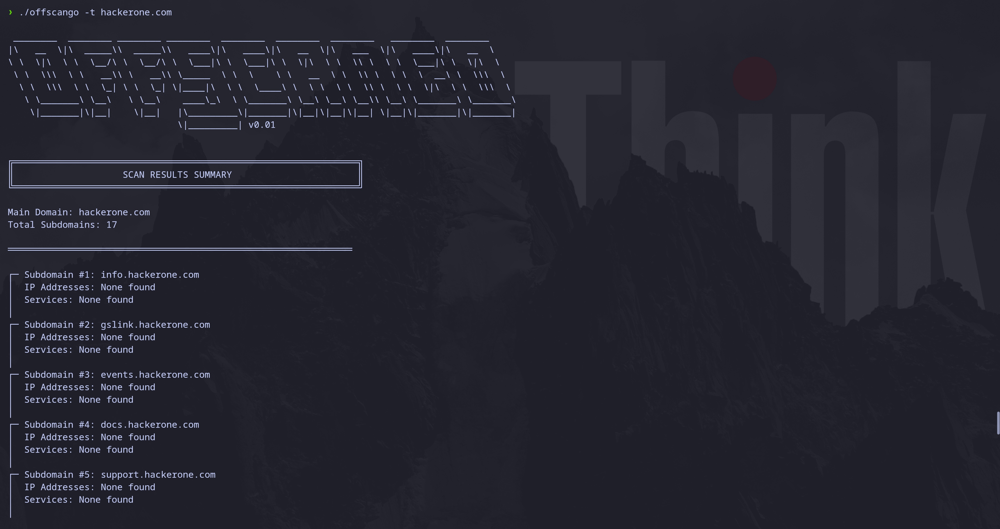
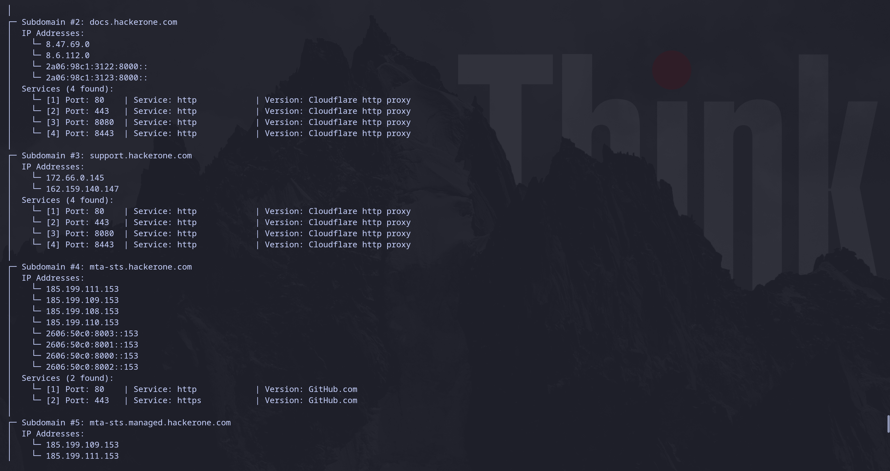

# OffSec Scan Go

Инструмент для автоматизированного сканирования и эксплуатации в области offensive security. Выполняет поиск поддоменов целевого домена с помощью SubFinder и разрешение IP-адресов для найденных поддоменов.



## Deploy&Run

Проект написан на Go. Требуется Go 1.24 или выше.

Основные зависимости:
- `github.com/projectdiscovery/subfinder/v2 v2.10.1` - инструмент для поиска поддоменов

Для установки зависимостей выполните:
```bash
go mod download
```
