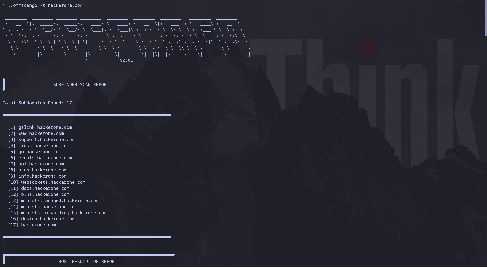

# OffSec Scan Go

Автоматизированный инструмент для сканирования и анализа безопасности в области offensive security. Выполняет комплексное сканирование целевого домена, включая поиск поддоменов, разрешение IP-адресов, сканирование портов и сервисов.

## Описание

OffSec Scan Go - это инструмент командной строки, написанный на Go, предназначенный для автоматизированного сбора информации о целевых доменах. Инструмент объединяет несколько этапов разведки в единый процесс сканирования:

- Поиск поддоменов с использованием SubFinder
- Разрешение IP-адресов для найденных поддоменов
- Сканирование портов и определение версий сервисов с помощью Nmap
- Брутфорс SSH-сервисов (экспериментальная функция)

## Возможности

- **Поиск поддоменов**: Автоматическое обнаружение поддоменов целевого домена с использованием множественных источников данных
- **Разрешение IP-адресов**: Определение IP-адресов для всех найденных поддоменов
- **Сканирование портов**: Обнаружение открытых портов на целевых хостах
- **Определение сервисов**: Идентификация сервисов и их версий на открытых портах
- **Детальные отчеты**: Структурированный вывод результатов сканирования по каждому модулю
- **Модульная архитектура**: Расширяемая система адаптеров для добавления новых модулей сканирования

## Требования

### Системные требования

- Операционная система: Linux, macOS, или Windows
- Go версии 1.24 или выше
- Nmap (должен быть установлен и доступен в PATH)

### Установка зависимостей системы

#### Debian/Ubuntu/Kali Linux

```bash
sudo apt-get update
sudo apt-get install -y nmap
```

#### macOS

```bash
brew install nmap
```

#### Windows

Скачайте и установите Nmap с официального сайта: https://nmap.org/download.html

### Проверка установки Nmap

```bash
nmap --version
```

## Установка

### Клонирование репозитория

```bash
git clone <repository-url>
cd offsec-scan-go
```

### Установка зависимостей Go

```bash
go mod download
```

### Сборка проекта

```bash
go build -o scanner ./cmd/scanner
```

Или для установки в систему:

```bash
go install ./cmd/scanner
```

## Использование

### Базовое использование

```bash
./scanner -t example.com
```

или

```bash
./scanner --target example.com
```

### Параметры командной строки

```
-t, --target string    Целевой домен для сканирования (обязательный параметр)
```

### Примеры использования

#### Сканирование домена

```bash
./scanner -t example.com
```

#### Сканирование с выводом в файл

```bash
./scanner -t example.com > scan_results.txt 2>&1
```

## Процесс сканирования

Инструмент выполняет сканирование в следующем порядке:

1. **SubFinder**: Поиск поддоменов целевого домена
2. **Host Resolution**: Разрешение IP-адресов для найденных поддоменов
3. **Nmap Scanning**: Сканирование портов и определение версий сервисов
4. **SSH Bruteforce**: Попытка брутфорса SSH-сервисов (если обнаружены)

После завершения каждого этапа выводится детальный отчет с результатами.

## Структура проекта

```
offsec-scan-go/
├── cmd/
│   └── scanner/
│       └── main.go              # Точка входа приложения
├── internal/
│   ├── adapters/                 # Адаптеры для внешних инструментов
│   │   ├── host/
│   │   │   └── host.go           # Адаптер для разрешения IP-адресов
│   │   ├── nmap/
│   │   │   ├── nmap.go           # Адаптер для Nmap сканирования
│   │   │   └── xmlNmapParser.go  # Парсер XML результатов Nmap
│   │   ├── ssh-brute/
│   │   │   └── ssh.go            # Адаптер для SSH брутфорса
│   │   └── subfinder/
│   │       └── subfinder.go      # Адаптер для SubFinder
│   ├── domain/
│   │   ├── bruteforce.go         # Доменные модели для брутфорса
│   │   └── scanner.go            # Доменные модели и интерфейсы
│   └── usecase/
│       └── baseScan.go           # Бизнес-логика базового сканирования
├── pkg/
│   └── logger/
│       ├── logger.go             # Интерфейс логгера
│       └── zerolog.go            # Реализация логгера на основе zerolog
├── go.mod
├── go.sum
└── README.md
```

## Зависимости

### Основные зависимости

- `github.com/projectdiscovery/subfinder/v2` - Инструмент для поиска поддоменов
- `github.com/rs/zerolog` - Структурированное логирование

### Внешние инструменты

- **Nmap** - Сканирование портов и определение версий сервисов

## Формат вывода

Инструмент выводит результаты в структурированном виде:

1. **SubFinder Report**: Список найденных поддоменов
2. **Host Resolution Report**: Статус доступности доменов и их IP-адреса
3. **Nmap Scan Report**: Открытые порты, сервисы и их версии
4. **Final Summary**: Общая сводка по всем найденным поддоменам, IP-адресам и сервисам

## Разработка

### Запуск тестов

```bash
go test ./...
```

### Форматирование кода

```bash
go fmt ./...
```

### Проверка кода

```bash
go vet ./...
```

### Сборка для разных платформ

```bash
# Linux
GOOS=linux GOARCH=amd64 go build -o scanner-linux ./cmd/scanner

# macOS
GOOS=darwin GOARCH=amd64 go build -o scanner-macos ./cmd/scanner

# Windows
GOOS=windows GOARCH=amd64 go build -o scanner-windows.exe ./cmd/scanner
```

## Расширение функциональности

Для добавления нового адаптера сканирования:

1. Создайте новый пакет в `internal/adapters/`
2. Реализуйте интерфейс `domain.Scanner`:
   ```go
   type Scanner interface {
       Scan(ctx context.Context, scanData *Scan) (chan BruteforcePart, error)
       GetName() string
       GetReport() error
   }
   ```
3. Добавьте адаптер в функцию `initScanners()` в `cmd/scanner/main.go`

## Известные ограничения

- SSH брутфорс использует мок-данные и предназначен только для демонстрации архитектуры
- Сканирование Nmap выполняется последовательно для каждого поддомена и может занять значительное время
- Требуется наличие Nmap в системе

## Устранение неполадок

### Ошибка: "nmap: command not found"

Убедитесь, что Nmap установлен и доступен в PATH:

```bash
which nmap
```

### Ошибка: "could not enumerate subfinder"

Проверьте подключение к интернету и доступность DNS-резолверов.

### Медленное сканирование

Сканирование Nmap может занимать длительное время в зависимости от количества найденных поддоменов. Это нормальное поведение.

## Disclaimer

**ВАЖНО: ПРАВОВОЕ ПРЕДУПРЕЖДЕНИЕ**

Данный инструмент разработан исключительно в образовательных целях и для легитимного тестирования безопасности (белый хакинг, пентестинг) с явного письменного разрешения владельца целевой системы.

**Использование данного инструмента:**

- Разрешено только на системах, которыми вы владеете, или на системах, для тестирования которых у вас есть явное письменное разрешение
- Запрещено для несанкционированного доступа к чужим системам
- Запрещено для любых незаконных действий

**Разработчик не несет ответственности:**

- За любое неправомерное использование данного инструмента
- За любой ущерб, причиненный использованием или неправильным использованием инструмента
- За нарушение законов или правил, связанных с использованием инструмента

Используя данный инструмент, вы подтверждаете, что:

1. Понимаете правовые последствия несанкционированного доступа к компьютерным системам
2. Будете использовать инструмент только в законных целях
3. Получили все необходимые разрешения перед тестированием любых систем
4. Берете на себя полную ответственность за свои действия

**Использование данного инструмента означает ваше согласие с данными условиями.**

## Лицензия

[Укажите лицензию проекта]

## Автор

[Укажите информацию об авторе]

## Благодарности

- ProjectDiscovery за SubFinder
- Nmap Project за инструмент Nmap
- Сообщество Go за отличные библиотеки
